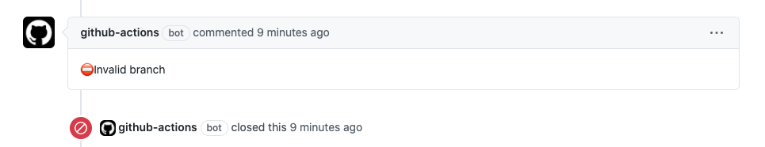

<div align="center">
    <h1>only-merge-from-action</h1>
</div>

<p>Github action to close a PR if the base branch is not the one specified in the `allowed-branch`.</p>



---

## Table of Contents

<!-- START doctoc generated TOC please keep comment here to allow auto update -->
<!-- DON'T EDIT THIS SECTION, INSTEAD RE-RUN doctoc TO UPDATE -->


- [Inputs](#inputs)
  - [`github-token`](#github-token)
  - [`protected-branch`](#protected-branch)
  - [`allowed-branch`](#allowed-branch)
- [Example of usage](#example-of-usage)
- [Example using a custom branches](#example-using-a-custom-branches)
- [Development](#development)
  - [Close release](#close-release)
  - [Documentation](#documentation)

<!-- END doctoc generated TOC please keep comment here to allow auto update -->

## Inputs

### `github-token`

**Required** The github token to comment in the PR.

### `protected-branch`

The name of the protected branch

### `allowed-branch` 

The name of the branch allowed to merge over the protected branch

## Example of usage

```yaml
uses: raulanatol/only-merge-from-action@v1.0.0
with:
  github-token: ${{ secrets.GITHUB_TOKEN }}
```
  
## Example using a custom branches

**.github/workflows/main.yml**

```yaml
on: pull_request

jobs:
  build:
    runs-on: ubuntu-latest
    steps:
    - uses: raulanatol/only-merge-from-action@v1.0.0
      with:
        github-token: ${{ secrets.GITHUB_TOKEN }}
        protected-branch: production
        allowed-branch: stage
```

## Development

### Close release

To close a release you only need to execute the makefile with `release_{major|minor|patch}`

Example:

```shell script
make release_minor
``` 

### Documentation

To generate the documentation you only need to execute the makefile with `docs`.

> Using [doctoc](https://github.com/thlorenz/doctoc)

```shell script
make docs
``` 
